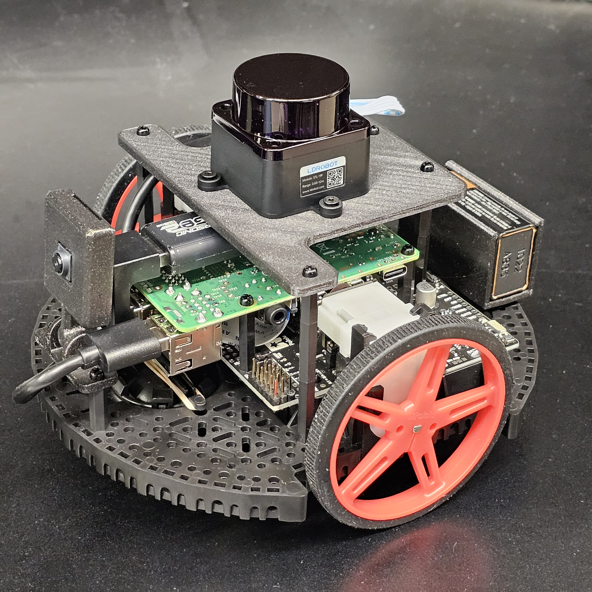
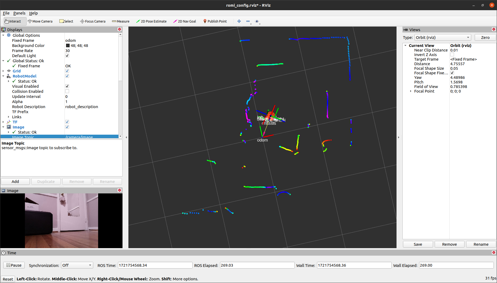
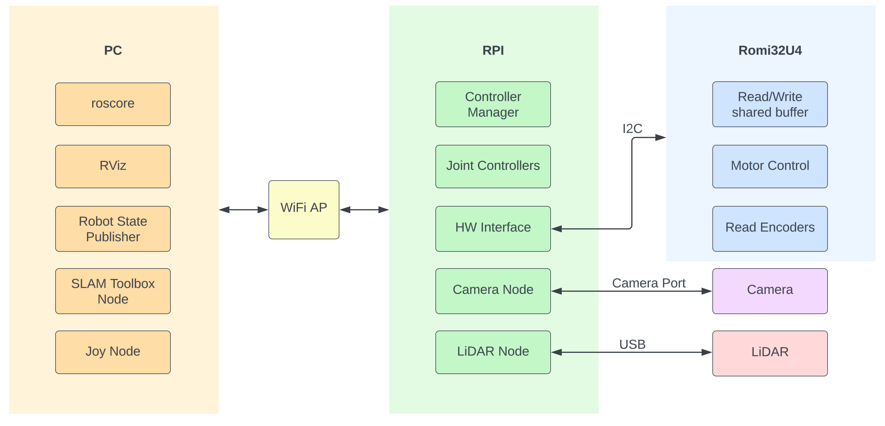
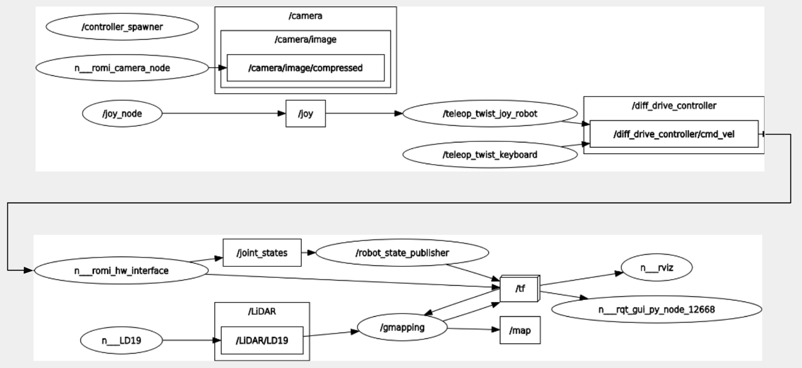
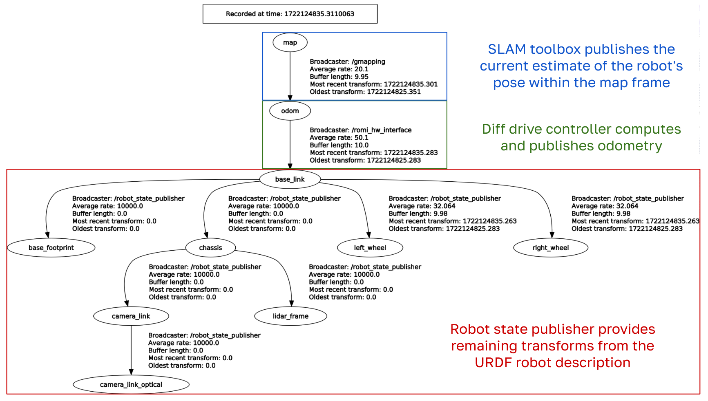

# ROS Simulation for Pololu Romi Robot

## Overview
This project is a ROS simulation for the Pololu Romi robot. The Romi communicates with a Raspberry Pi running Ubuntu 20.04 and ROS Noetic. It includes models, controllers, and necessary configurations to simulate the Romi robot in a ROS environment. The goal is to provide a platform for testing and developing robotic algorithms.


## Table of Contents
- [ROS Simulation for Pololu Romi Robot](#ros-simulation-for-pololu-romi-robot)
  - [Overview](#overview)
  - [Table of Contents](#table-of-contents)
  - [Parts List](#parts-list)
    - [Robotics Kit](#robotics-kit)
    - [Electronics](#electronics)
    - [Power Supply](#power-supply)
    - [Hardware](#hardware)
    - [3D Printed Parts](#3d-printed-parts)
  - [Images](#images)
  - [Installation](#installation)
    - [Upload the Arduino code to the Romi32U4](#upload-the-arduino-code-to-the-romi32u4)
    - [Install Raspberry Pi Image](#install-raspberry-pi-image)
    - [Setup ROS workspaces](#setup-ros-workspaces)
  - [Usage](#usage)
  - [System Overview](#system-overview)
- [Additional Documentation](#additional-documentation)


## Parts List

### Robotics Kit
- Pololu Romi Robot Kit

### Electronics
- Raspberry Pi Model 4B
- Raspberry Pi Camera V2.1
- LD19 LiDAR Module
- Compact USB (min 32GB, USB 3.0)

### Power Supply
- 6 Rechargable AA Batteries

### Hardware
- M2 Assorted Nylon/Brass Standoffs
- Machine Screws:
  * 4x M2 for Raspberry Pi
  * 4x M2 + 3x M2.5 for LiDAR mount
  * 2x M2 for Camera Mount
- 40 Pin Pi Header Extender (Optional)

### 3D Printed Parts
- [3D Printed LiDAR Plate (w/Supports)](docs/files/CAD/lidar_mount.stl)
- [3D Printed Camera Housing](https://www.printables.com/de/model/693396/files)


## Images

<div style="display: flex; justify-content: left; align-items: left;">
   <div style="text-align: center; margin: 10px;">
      
      <p>Romi Robot</p>
   </div>

   <div style="text-align: center; margin: 10px;">
      
      <p>Romi Robot Model</p>
   </div>

   <div style="text-align: center; margin: 10px;">
      
      <p>RViz Display</p>
   </div>

   <div style="text-align: center; margin: 10px;">
      
      <p>RViz SLAM</p>
   </div>
</div>


## Installation

### Upload the Arduino code to the Romi32U4

1. Install Pololu RPi Slave libarary and Romi32U4 library in the Arduino IDE

2. Add the Pololu boards package url `https://files.pololu.com/arduino/package_pololu_index.json`

3. Install Pololu A-Star Boards in the boards manager

4. Install windows drivers https://www.pololu.com/docs/0J69/5.1

5. Restart IDE

6. Add [Arduino/DeadManSwitch.h](Arduino/DeadManSwitch.h) to the libraries folder

7. Plug in Romi32U4 and upload [Arduino/RomiRPiSlave.ino](Arduino/RomiRPiSlave.ino)

### Install Raspberry Pi Image

1. Install [Raspberry Pi Imager](https://www.raspberrypi.com/software/)

2. Download the [image file](https://drive.google.com/file/d/1gfvOr653rBKGsRue2pg0K5v4wNSrjCS1/view?usp=sharing)

3. Make the following selections:
   ```
    > Choose Device > Pi 4
    > Choose OS > Use Custom > rpi_romi_os.img.gz
    > Choose Storage > Select USB drive
    > Next

   Would you like to apply OS customization settings? > No  
   ```

4. Write to the USB

5. WiFi configuration can be done on a Linux machine.  
   * Plug in USB  
   * `sudo nano /media/*user*/writable/etc/netplan/50-cloud-init.yaml`  
   * Edit the WiFi SSID and Password  
   * Save and exit: *Ctrl+s, Ctrl+x*  
   
6. Raspberry Pi default login:
   ```
   User: romi
   Password: romi32u4
   ```
   Change password with `passwd`  

### Setup ROS workspaces

This workspace should be setup on both a PC and the Romi Raspberry Pi for full usage. This GitHub repo contains both the PC and RPi nodes and will automatically build the correct files based on the device architecture. The Raspberry Pi image above already includes a copy of this repo.  

The PC will run the ROS master and display the RViz and Gazebo windows. The Raspberry Pi will run the hardware interface with the Romi board, as well as all sensor nodes. 

Steps for PC with Ubuntu 20.04 and ROS Neotic:

1. Create or `cd` into a ROS Noetic catkin workspace
   ```console
   mkdir -p ~/catkin_ws/src
   ```

2. Clone this repo in the `src` folder of your catkin workspace:
   ```console
   cd ~/catkin_ws/src
   ```
   ```console
   git clone https://github.com/charlie51135/robot-sim.git
   ```
   
3. Install package dependencies:
   ```
   rosdep install --from-paths src --ignore-src -r -y
   ```

4. Build the catkin workspace:
   ```console
   cd ~/catkin_ws/ && catkin_make
   ```

5. Source packages:
   ```console
   echo "source /opt/ros/noetic/setup.bash" >> ~/.bashrc
   echo "source ~/catkin_ws/devel/setup.bash" >> ~/.bashrc
   source ~/.bashrc
   ```

   
## Usage

1. Configure [WiFi settings](docs/ros_ip_setup.md)

2. Launch RViz, the robot desciption and the controllers from a PC:
   ```console
   roslaunch my_robot romi_base.launch
   ```
   *Note: roslaunch will automatically start a [ROS Master](http://wiki.ros.org/Master) if one does not exist*  

3. Launch the hardware interface on the Raspberry Pi:
   ```console
   roslaunch romi_base romi_hw.launch
   ```

4. Launch the camera node on the Raspberry Pi:
   ```console
   roslaunch romi_camera romi_camera_node.launch
   ```

5. Launch the LiDAR node on the Raspberry Pi:
   ```console
   roslaunch ldlidar ld19.launch
   ```
6. Launch the SLAM node on the PC:
   ```console
   roslaunch slam_toolbox online_async.launch
   ```

The nodes are modularized but may be launched together by adding an include line to a .launch file
```xml
<include file="$(find *package_name*)/launch/*launch_file_name*.launch"/>
```

## System Overview

The communication between the PC and the Raspberry Pi is through a WiFi network in which there is a single ROS Master. The PC is used for visualization, high-level control is done on the Raspberry Pi, and low-level control is done on the Romi. The Raspberry Pi communicates with the Romi through a hardware interface over i2c, described in [ROS Control](docs/ros_control.md).

<div style="display: flex; justify-content: left; align-items: left;">
   <div style="text-align: center; margin: 10px;">
      
      <p>ROS Nodes Running By Device</p>
   </div>
</div>

</br>

<div style="display: flex; justify-content: left; align-items: left;">
   <div style="text-align: center; margin: 10px;">
      
      <p>ROS RQT Graph</p>
   </div>
</div>

</br>

<div style="display: flex; justify-content: left; align-items: left;">
   <div style="text-align: center; margin: 10px;">
      
      <p>ROS TF Tree</p>
   </div>
</div>

</br>
</br>

# Additional Documentation

* [Ros Control Setup](docs/ros_control.md)
* [Raspberry Pi Setup](docs/rpi_setup.md)
* [Camera Setup](docs/rpi_camera.md)
* [Power Consumption](docs/power.md)
* [Accuracy Testing](docs/accuracy_testing.md)
* [Image Creation](docs/create_img.md)

</br>

* [Teleop-Twist-Keyboard Setup](docs/teleop_twist_keyboard.md)
* [Bluetooth Controller Setup](docs/bluetooth_controller.md)
* [Multiple Robots ROS Config](docs/two_robots_rviz.md)
* [Wifi AP](docs/wifi_ap.md)