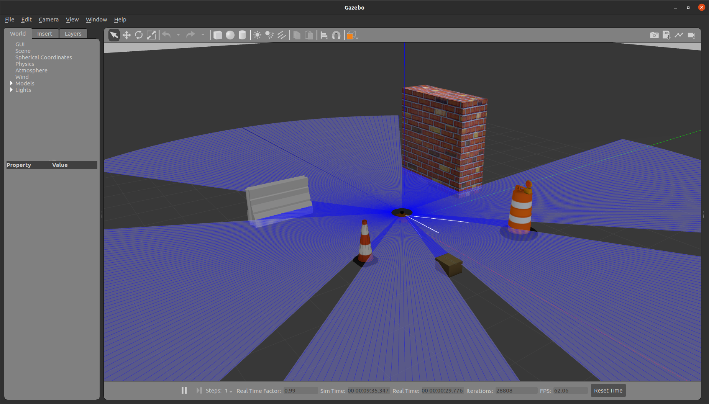

# ROS Simulation for Pololu Romi Robot

<div style="display: flex; justify-content: left; align-items: left;">
   <div style="text-align: center; margin: 10px;">
      
      <p>Romi Robot</p>
   </div>

   <div style="text-align: center; margin: 10px;">
      
      <p>Romi Robot Model</p>
   </div>

   <div style="text-align: center; margin: 10px;">
      
      <p>RViz Display</p>
   </div>

   <div style="text-align: center; margin: 10px;">
      
      <p>Gazebo Sim</p>
   </div>
</div>


## Overview
This project is a ROS simulation for the Pololu Romi robot. The Romi communicates with a Raspberry Pi running Ubuntu 20.04 and ROS Noetic. It includes models, controllers, and necessary configurations to simulate the Romi robot in a ROS environment. The robot operation can be visualized using RViz and also simulated with Gazebo. The goal is to provide a platform for testing and developing robotic algorithms in a simulated environment and deploy them on actual hardware.


## Table of Contents
- [ROS Simulation for Pololu Romi Robot](#ros-simulation-for-pololu-romi-robot)
  - [Overview](#overview)
  - [Table of Contents](#table-of-contents)
  - [Parts List](#parts-list)
  - [Installation](#installation)
  - [Usage](#usage)
- [Additional Documentation](#additional-documentation)


## Parts List
- **Pololu Romi Robot Kit for FIRST**
- **Raspberry Pi Model 4B**
- **Raspberry Pi Camera V2.1**
- **LD19 LiDAR Module**
- **Compact USB or MicroSD card**
- **6 AA Batteries**
- **M2 Assorted Nylon/Brass Standoffs**
- **13 M2x6mm Machine Screws**
- **3D Printed LiDAR Plate (w/Supports)**
- **3D Printed Camera Housing**
- **40 Pin Pi Header Extender (Optional)**


## Installation

This workspace should be setup on both a PC and the Romi Raspberry Pi for full usage. The PC will run the ROS master and display the RViz and Gazebo windows. The Raspberry Pi will run the hardware interface with the Romi board, as well as all sensor nodes. 

1. Create or `cd` into a ROS Noetic catkin workspace
   ```console
   mkdir -p ~/catkin_ws/src
   ```

2. Clone this repo in the `src` folder of your catkin workspace:
   ```console
   cd ~/catkin_ws/src
   ```
   ```console
   git clone https://github.com/charlie51135/robot-sim.git
   ```
   
3. Install package dependencies:
   ```
   rosdep install --from-paths src --ignore-src -r -y
   ```

4. Build the catkin workspace:
   ```console
   cd ~/catkin_ws/ && catkin_make
   ```

5. Source packages:
   ```console
   source ~/catkin_ws/devel/setup.bash
   ```

   
## Usage

1. Configure [WiFi settings](docs/multiple_machines.md)

2. Launch RViz, the robot desciption and the controllers from a PC:
`roslaunch my_robot romi_base.launch`

3. Launch the hardware interface on the Raspberry Pi:
`roslaunch romi_base romi_hw.launch`

4. Launch the camera node on the Raspberry Pi:
`roslaunch romi_camera romi_camera_node.launch`

5. Launch the LiDAR node on the Raspberry Pi:
`roslaunch ldlidar ld19.launch`

# Additional Documentation

* [Raspberry Pi Setup](docs/rpi_setup.md)
* [Camera Setup](docs/rpi_camera.md)
* [Bluetooth Controller Setup](docs/bluetooth_controller.md)
* [Multiple Machines ROS Setup](docs/multiple_machines.md)
* [Teleop-Twist-Keyboard Setup](docs/teleop_twist_keyboard.md)

<br>

* [Ros Control Notes](docs/ros_control.md)
* [Two Simultaneous Robots](docs/two_robots_rviz.md)
* [Wifi AP](docs/wifi_ap.md)