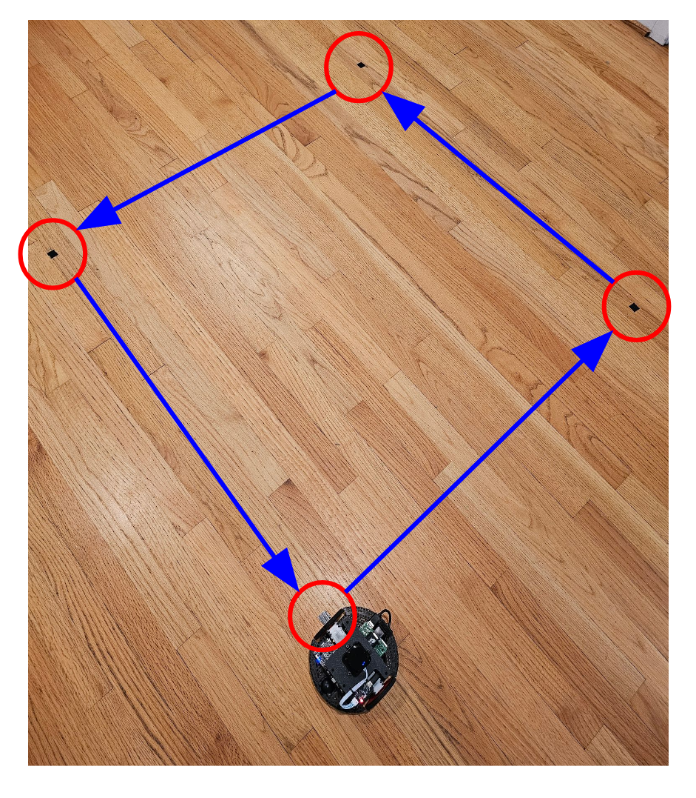
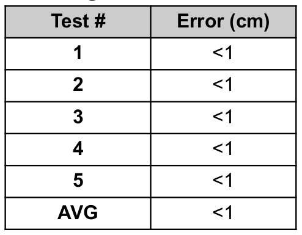
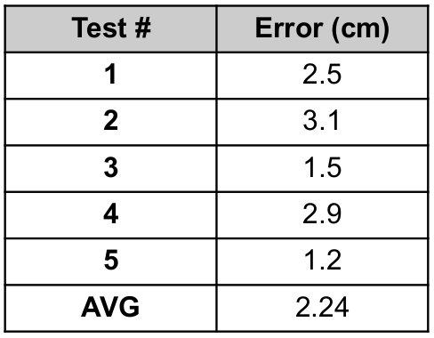

# Accuracy Testing for Pololu Romi Robot

The differential drive controller used in ROS calculates the position of the robot with respect to the robots origin, or **odom**. The controller uses the encoder values from the robot to calculate the instantaneous velocity of each wheel. This [dead reckoning](https://en.wikipedia.org/wiki/Dead_reckoning) method will slowly drift over time and can be improved by using the LiDAR and SLAM to update its **odom** based on the robots position in the **map**.

## Test Square
A 1-meter square was marked on the ground for the robot to travel.

   

      
   

## 1-Meter Straight Line Test
The robot was driven a distance of 1 meter, and the position offset in ROS was measured using the measure tool.

   

      
   

   

      
   

## 1-Meter Square Test
The robot was then driven on a square 1 meter path, returning to the original position. The offset in ROS was measured using the measure tool.

   

      
   

   

      
   

