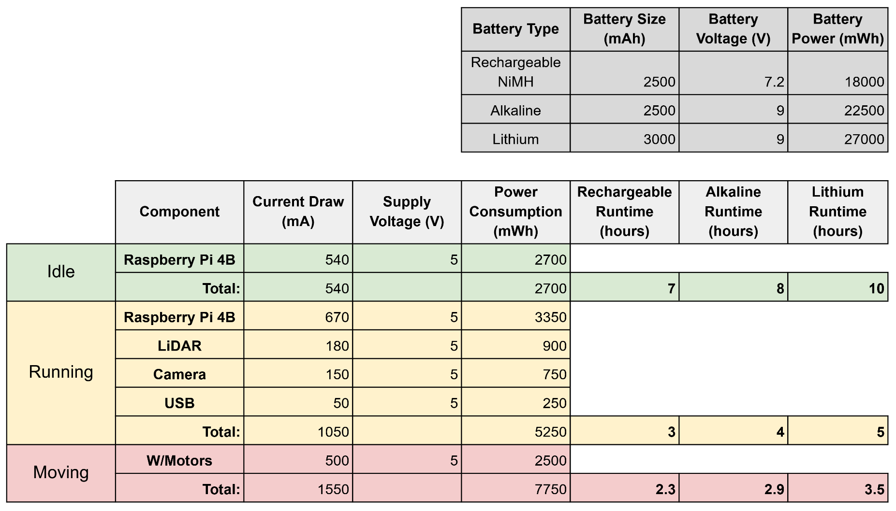

# Power Consumption Analysis for Pololu Romi Robot

Understanding the power consumption of a robotic system is crucial for ensuring efficient energy use. Each component in the system contributes to the overall power demand, which places hard limits on the robot's runtime. 

The power consumption for this robot was measured using USB current meters. The Raspberry Pi and Romi32U4 were powered seperately to accurately measure the power comsumption of the main board and motors, a Raspberry Pi running Ubuntu/ROS, a USB flash drive, an LD19 Lidar module, and a Raspberry Pi V2.1 camera.

## Components Overview
### Main Board and Motors
    Average 500mA 

### Raspberry Pi 4B
    Idle: 540mA
    Running ROS: 670mA

### USB Flash Drive
    50mA

### LD19 Lidar Module
    180mA

### Raspberry Pi V2.1 Camera
    150mA

## Total Power Consumption
    Idle: 540mA
    Running ROS: 1.05A
    Running ROS and Driving: 1.55A

## Runtime Calculations

   

      
   

