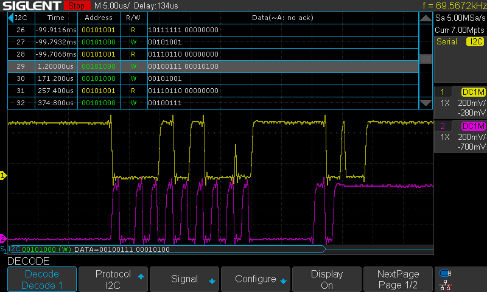

# Set up ros_control for diff drive robot


## Overview

ROS control is a framework in the ROS ecosystem that enables the control of robots in a modular and scalable manner. 

### Key Components of ROS Control

1. **Controller Manager**:
   - The controller manager is responsible for loading, unloading, starting, and stopping controllers.
   - It manages the resources in use by each controller and ensures they are properly interfaced with the hardware.
   - Multiple controllers that require the same resource may be loaded at the same time, but can not run at the same time.

2. **Controllers**:
   - Controllers are software components that contain the algorithms for controlling robot actuators, such as motors.
   - Different types of controllers exist for various purposes, such as position, velocity, and effort control.

3. **Hardware Interface**:
   - The hardware interface provides an abstraction layer between the controllers and the robot's hardware.
   - It defines how the controllers communicate with the hardware components, through writing commands and recieving updated states.
   - Runs a continous read/write loop 
   - By using the standard ROS interface, new ROS Control plugins can be added without modification to the hardware interface.
  

<div style="display: flex; justify-content: left; align-items: left;">
   <div style="text-align: center; margin: 10px;">
      
      <p><a href="http://wiki.ros.org/ros_control">http://wiki.ros.org/ros_control</a></p>
   </div>
</div>

</br>

### Steps to Control a Robot Using ROS Control

1. **Setup Workspace**:
   - Install ROS controller packages  
      `sudo apt install ros-noetic-ros-control ros-noetic-ros-controllers ros-noetic-rosparam-shortcuts`
   - Create new robot_base package  
      `cd ~/catkin_ws/src`  
      `catkin_create_pkg romi_base roscpp rospy hardware_interface controller_manager diff_drive_controller sensor_msgs` 
   - Search for active controllers  
      `rosservice list | grep controller_manager`  

2. **Define the Hardware Interface**:
   - Created a custom [hardware interface](../romi_base/include/romi_base/romi_hw_interface.h) that inherits from `hardware_interface::RobotHW`.
   - Implemented methods to write commands to actuators and read sensor data.
     - For this project, the Romi 32U4 board is used for lower level control. Theerefore, the HW interface methods only read and write to shared memory.
     - Wrote new [cpp class](../romi_base/include/romi_base/a_star.h) to communicate with the Romi board. 

3. **Configure Controllers**:
   - Specified the controllers and joints to be used in a [configuration YAML file](../my_robot/config/controllers.yaml).
   - Registered the join state and joint velocity interfaces in the [HW interface class](../romi_base/src/romi_hw_interface.cpp).
   - For simulation, the diff_drive_controller communicates with gazebo_ros_control. For the real robol, a controller manager is used to handle the resources of hardware_interace.

4. **Launch the Hardware Interface**:
   - A launch file can be used to load the hardware interface and controllers.
   - Launch file:
     ```xml
      <launch>
          <!-- Launch romi hw interface node -->
          <node name="romi_hw_interface" pkg="romi_base" type="romi_base" output="screen"/>

          <!-- Load joint controller configurations from YAML file to parameter server -->
          <rosparam file="$(find my_robot)/config/controllers.yaml" command="load"/>

          <!-- Load the controllers -->
          <node name="controller_spawner" pkg="controller_manager" type="spawner" respawn="false"
              output="screen" args="diff_drive_controller joint_state_controller">
          </node>
      </launch>
     ```
  - The diff_drive_controller only publishes the transform between odom and base_link. The robot_state_publisher is also required to publish the rest of the transformations for display in RViz.

5. **Command the Robot**:
   - Use ROS topic diff_drive_controller/cmd_vel, to send commands to the robot.
   - For example, to move a joint at a specific velocity, publish the desired velocities to the controller's command topic. The robot will only maintain this command until the dead mans switch times out. A constant stream of messages is required for continous movement.
   - Teleop-Twist-Joy and Teleop-Twist-Keyboard are two nodes that publish command velocity messages from joystick or keyboard input.


## Additional Notes:

### WiringPi setup for I2C comm (wiringPiI2C.h)
https://github.com/WiringPi/WiringPi  

To install wiringPi:  
`git clone https://github.com/WiringPi/WiringPi.git`  
`cd WiringPi`  
`./build`  
To un-install wiringPi:  
`./build uninstall`  

Updated CMakeLists.txt  
```
link_directories(
  /usr/local/lib
)

set(THREADS_PREFER_PTHREAD_FLAG ON)
find_package(Threads REQUIRED)
target_link_libraries(romi_base PRIVATE Threads::Threads)
target_link_libraries(romi_base PRIVATE ${catkin_LIBRARIES} wiringPi wiringPiDev)
```


Wrote new cpp AStar class to read and write data according to the data structure on the romi.
```
// https://docs.python.org/3.6/library/struct.html#format-characters
// ? - bool           - 1 byte
// c - char           - 1 byte
// B - unsigned char  - 1 byte
// h - short          - 2 bytes
// H - unsigned short - 2 bytes
// f - float          - 4 bytes
// s - char[]         - preceding # is bytes

struct Data
{                                 // Address (byte)
  bool yellow, green, red;        // 0 1 2
  bool buttonA, buttonB, buttonC; // 3 4 5 

  int16_t leftMotor, rightMotor;  // 6-7 8-9
  uint16_t batteryMillivolts;     // 10-11
  uint16_t analog[6];             // 12-23

  bool playNotes;                 // 24
  char notes[14];                 // 25-38

  int16_t leftEncoder, rightEncoder; // 39-40 41-42
};
```

WiringPi is only for arm architecture, so catkin_make would not build on desktop x86. CMakeLists was edited for the romi_base package to check the architecture before linking to WiringPi. 


### Potential issue:
Very occasionally incorrectly read the value 20 from the right encoder. While it was infrequent and corrected one read cycle later, there was still a flicker seen in RViz. Over time, these small glitches may develop into error in the reported position of the robot.  

Looking with an [oscilliscope](files/oscilliscope_testing.jpg) the problem became clear. SMBus protocol, as used by WiringPi, involves 3 bytes of data for a write, while a read 16bit requires 5.
Write: (S) Addr wr, reg, data (P)
Read: (S) Addr wr, reg, (S) addr rd, data low, data high (P)
The difference between write and read is that the read sends a second start signal before the address to read (3rd byte).  

As seen on the oscilliscope, when the master is initiating a read command, the second start bit is missed, and interpreted as the first bit of data to write. Instead of interpreting the read command at address 41-[start, 00101000, ack], the Romi board interprets it as a write command of 20- [00010100, ack].  

Since 20 was just written into the right encoder register, the subsequent read will be 20, after which is correctly updated by the main loop on the Romi board. 

<div style="display: flex; justify-content: left; align-items: left;">
   <div style="text-align: center; margin: 10px;">
      
      <p>Failed 4-byte read</p>
   </div>
</div>


### The solution:
Looking at the Arduino PololuRPiSlave library, the recieve data function sets AND retains an index starting at the recieved address. This value is temporarily stored and auto incremented on each read. Therefore, the second start bit could be completely avoided by not using the formal SMBus protocol. A simple write address followed by a series of reads is sufficient. 

Instead of reading 16 bytes at the desired address:
```
left = wiringPiI2CReadReg16(fd, 39);
right = wiringPiI2CReadReg16(fd, 41);
```
The address of the first byte could be written then the next 4 bytes could be read and reassembled back into the 16 bit numbers. A small delay was added between the write and read as recommended by Pololu since the AVR's TWI modue cannot handle a quick transition.
```
wiringPiI2CWrite(fd,39);
delayMicroseconds(100);
left = wiringPiI2CRead(fd) + (wiringPiI2CRead(fd) << 8);
right = wiringPiI2CRead(fd) + (wiringPiI2CRead(fd) << 8);
```
<div style="display: flex; justify-content: left; align-items: left;">
   <div style="text-align: center; margin: 10px;">
      
      <p>Successful 4-byte read</p>
   </div>
</div>
</br>
</br>

# Solved issues:

1. ### Stuck `diff_drive_controller` loading
    **Solution**: 
    - Added async spinner to `hw_interface`
    - Removed namespace from `controllers.yaml`
    - Ensure Gazebo ROS controller is not active; restart `roscore` if needed
    - Remap joy `cmd_vel` to `diff_drive_controller/cmd_vel`
    - Ensure Romi AStar board is turned on

2. ### Robot showing up and moving (but glitching back to origin)
    **Solution**:
    - `romi_hw_interface` subscribed to `/joint_states` while robot state publisher was publishing to `/robot/joint_states`

3. ### Romi only moves forward for a bit before stopping
    **Solution**:
    - Joystick was in event mode, meaning if the state was not changing, no new messages would be published. Fixed by adding `autorepeat_rate` parameter to the joy node. This parameter specifies the frequency to republish the last state if no changes are detected.

4. ### Using Joy node to publish `cmd_vel`, the angular velocities for each wheel are within `[-14, 14]` on the x-axis but only between `[-1, 1]` on the y-axis. The result is that turning speeds are incredibly slow or even clipped to zero.
    **Solution**:
    - Added a scaling factor of 7 to the y-axis.


5. ### Occasional Position Glitching
    <video src="files/simplescreenrecorder-2024-04-02_14.28.48.mp4" width="320" height="240" controls></video>

   **Solution**:
   - Reviewing debug statements showed the glitching occurring when the encoder values underflowed.
   - Fixed by adding a `calculate_delta` function that accounts for overflows and underflows.

   The robot's position was now consistent, but there was still some slight glitching.  
   Viewing the logs of the encoder values showed occasional readings of -1.  

    

   While the encoder values on the Romi are `uint16` (2 bytes), the WiringPi library converts them to `int16` (4 bytes) by ANDing with `0xFFFF`. This results in the loss of sign extension, and the readings are now in the range `[0, 65535]`. If there is an error reading from the board, the function returns -1.  
   </br>
   This was temporarily fixed by waiting until a valid reading was received. The permanent fix was to read the bytes individually and reassemble them with a bit shift.

